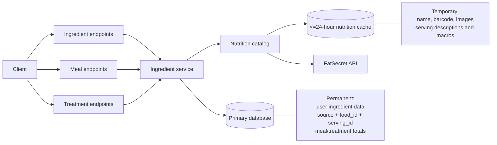

# Unified ingredients and nutrition-source integration

## Summary

Treat provider foods as shared external ingredient identities, but keep all FatSecret-owned descriptive and nutritional content in the expiring nutrition cache.

- User ingredients are owned by one user and permanently store their name, servings, and macros.
- FatSecret foods are materialized automatically as shared identities containing only `source`, `food_id`, and known `serving_id` values when first used.
- Meals and treatments continue storing aggregate macro snapshots.
- External nutrition is refreshed only when food composition changes.
- Metadata-only edits work without FatSecret.
- Remove the public `/nutrition` endpoints; nutrition becomes an internal service behind ingredient, meal, and treatment endpoints.

FatSecret explicitly permits indefinite storage of only `food_id` and `serving_id` from barcode lookup. Barcode, names, descriptions, and macros stay in the cache for at most 24 hours. See [FatSecret barcode lookup](https://platform.fatsecret.com/docs/v2/food.find_id_for_barcode) and [storable-data rules](https://platform.fatsecret.com/docs/guides/storable-data).



## Public API and data model

### Ingredient references

All ingredient inputs use one shape with either `ingredientId` or `productId`:

```json
{
  "productId": "12345",
  "servingId": "67890",
  "quantity": 1.5
}
```

```json
{
  "ingredientId": "0f6215cb-...",
  "servingId": "5ef0f586-...",
  "quantity": 2
}
```

Validation requires exactly one of `ingredientId` and `productId`. The same request and response models are used regardless of where the ingredient data comes from. Provider selection and the permanent `source` value are assigned inside the server; FatSecret is not part of the ingredient, meal, or treatment API contract.

### Ingredient endpoints

- `GET /api/v1/ingredients/search?query=&page=&pageSize=`
  - Returns grouped `personal` and `external` result sets.
  - Personal results come from the current user's ingredients.
  - External results come from the nutrition catalog and include attribution metadata.
  - Both groups contain the same ingredient response model; an item carries either `ingredientId` or `productId`.
  - Grouping exists only to keep local and provider pagination correct, not to create separate ingredient types in the client.

- Existing `GET /api/v1/ingredients/{identifier}`
  - Accepts either a user ingredient ID or a product ID in the same route.
  - Replaces the current `{id:guid}` route constraint with a string identifier.
  - Resolves an owned ingredient from the primary database when `identifier` is its GUID; otherwise resolves it as a product ID through the nutrition catalog.
  - Returns the same ingredient response model, including servings, `nutritionStatus`, and `dataAsOf`.

- `GET /api/v1/ingredients/barcode/{barcode}`
  - Available only to users with the Pro nutrition entitlement.
  - Resolves the barcode through the configured nutrition source; it never searches custom ingredients.
  - Uses cache-aside lookup: return an unexpired cached barcode match when available; otherwise query the provider and cache the barcode-to-product result and hydrated product data for no more than 24 hours.
  - Never writes the barcode to the primary user database.

- Existing `POST /ingredients`
  - Creates only a user-owned ingredient.
  - Removes client-settable `ProductId` and `Barcode` fields.
  - Custom ingredients have no barcode entry, lookup, or uniqueness behavior.

- Existing update/delete endpoints
  - Permit changes only when the current user owns the custom ingredient.
  - Server-created external identities remain read-only.

### Database representation

Use the existing `Ingredient` and `IngredientServing` tables as conditional identity records:

- User ingredient:
  - Required `OwnerUserId`, name, and permanent serving/macronutrient data.
  - `Source` and `ProductId` are null.

- External ingredient:
  - Required `Source` and `ProductId`; `OwnerUserId` is null.
  - Provider name, barcode, images, and other content remain null.
  - Unique index on `(Source, ProductId)`.

- External serving:
  - Stores the server-only `Source`, provider `ProductId`, and provider `ServingId`.
  - `(Source, ProductId)` identifies its parent external product; `IngredientId` is reserved for user-created ingredients.
  - A surrogate row ID may remain solely for existing meal/treatment foreign keys; it is never exposed in the API.
  - Descriptions, measurements, and macros remain null.

`UserIngredient` is no longer needed after custom ingredients receive an owner. Shared external identities are not owned or imported into a user's library; meals and treatments reference them through their existing internal foreign keys after the ingredient request is resolved.

The separate nutrition cache must store a complete normalized product and its servings, replacing the current single-serving-like cache entity. Every cached row receives an expiry no later than 24 hours after retrieval.

The primary `Ingredient.Barcode` column and its unique index can be removed entirely. A barcode exists only as a Pro lookup input and, when returned by the provider, as temporary cache content.

### Subscription behavior

- Custom ingredient create, read, search, update, and use remain available without Pro.
- Provider-backed search, product-ID lookup, barcode lookup, and adding a `productId` to meals/treatments require the Pro nutrition entitlement.
- Check entitlement before making a provider or cache call; reject unauthorized product-ID/barcode operations with `403 Forbidden`.
- After a user loses Pro, previously stored meal/treatment aggregate snapshots remain readable, but provider details are not hydrated until entitlement is restored.

## Service functions and flows

| Function | Purpose | Important parameters |
|---|---|---|
| `SearchIngredientsAsync` | Searches owned ingredients and the provider, returning grouped results. | `userId`, `query`, `page`, `pageSize`, `cancellationToken` |
| `GetExternalFoodAsync` | Cache-aside retrieval for display and detail reads. | `source`, `productId`, `allowCached`, `cancellationToken` |
| `GetExternalFoodByBarcodeAsync` | Resolves a barcode from the unexpired nutrition cache or provider, then caches the barcode-to-product match and hydrated product for no more than 24 hours; it never writes the barcode to the primary database. | `source`, `barcode`, `cancellationToken` |
| `GetOrCreateExternalIngredientIdentityAsync` | Idempotently creates or reuses the shared product and serving identity after provider validation. This is internal and called only by selection resolution. | `source`, hydrated product, `cancellationToken` |
| `ResolveIngredientSelectionsAsync` | Enforces exactly one ID per selection, validates local ownership, refreshes product IDs, materializes missing shared identities, and produces ephemeral macros for calculation. | `userId`, ingredient selections, `forceExternalRefresh`, `cancellationToken` |
| `RecalculateMealNutrition` | Calculates and persists the meal aggregate from resolved selections. | `meal`, resolved selections |
| `RecalculateTreatmentNutrition` | Uses stored meal snapshots plus freshly resolved direct ingredients. | `treatment`, meal lookup, resolved direct ingredients |

```mermaid
sequenceDiagram
    actor Client
    participant Ingredients as Ingredient API
    participant Resolver as Ingredient service
    participant DB as Primary DB
    participant Catalog as Nutrition catalog
    participant FS as FatSecret

    Client->>Ingredients: Search "porridge"
    par Personal search
        Ingredients->>DB: Search user's ingredients
    and External search
        Ingredients->>Catalog: Search provider
        Catalog->>FS: foods.search
    end
    Ingredients-->>Client: { personal, external }

    Client->>Resolver: Create/edit meal with productId selection
    Resolver->>DB: Validate owned local references
    Resolver->>Catalog: Force-refresh external foods
    Catalog->>FS: food.get
    alt Every external product and serving resolves
        Resolver->>DB: Upsert missing external identities
        Resolver->>DB: Save meal links and aggregate totals atomically
        Resolver-->>Client: Saved meal
    else Provider or external item unavailable
        Resolver-->>Client: Reject; existing meal remains unchanged
    end
```

### Calculation rules

- Creating a meal/treatment or changing its food composition:
  - Resolve every selection before mutating the entity.
  - Force-refresh direct external foods, bypassing cached content for calculation.
  - Reject the complete write if an external product or serving cannot be refreshed.
  - Local-only writes never depend on the provider.

- Metadata-only changes:
  - Do not refresh external nutrition.
  - Preserve existing aggregate totals.

- Treatment calculations:
  - Referenced meals contribute their stored aggregate snapshots.
  - Do not recursively refresh or mutate foods inside those meals.
  - Direct external ingredients are refreshed when the treatment's food composition changes.
  - Existing treatments never change when a referenced meal is later edited.

- Reads:
  - Persisted aggregate totals remain available during provider outages.
  - External names, serving descriptions, and current line-level nutrition are hydrated from valid cache/provider data.
  - If hydration fails, return the reference and stored aggregate with `nutritionStatus: "unavailable"` rather than failing the entire historical read.
  - Current hydrated line values may differ from stored aggregate snapshots until the meal/treatment is next edited.

## Migration and removal

- Add ingredient origin/owner/source fields and conditional constraints.
- Remove the permanent `Ingredient.Barcode` column, unique index, request fields, response fields, and custom-ingredient barcode logic.
- Convert existing `ProductId` ingredients to external identities, assuming their source is FatSecret.
- Immediately scrub provider-derived names, barcodes, images, serving descriptions, and macros from those permanent rows after preserving valid product/serving IDs.
- Convert local ingredients to user-owned rows:
  - Single-user rows receive that owner.
  - Shared local rows are duplicated per linked user.
  - Meal and treatment links are remapped using their owning meal/treatment user.
- Remove `UserIngredient` after local ownership is migrated; external identities require no per-user import link.
- Remove `/api/v1/nutrition/*`, `MapNutritionEndpoints`, and nutrition endpoint DTOs.
- Keep the nutrition projects as internal provider, cache, and catalog infrastructure.
- Update the nutrition README to remove the incorrect claim that provider barcodes are indefinitely storable.

## Assumptions

- Persisting calculated meal/treatment aggregate totals is permitted by the project's FatSecret agreement; this should receive explicit legal/licensing confirmation.
- Provider-returned barcodes are not persisted.
- FatSecret is the source assigned to existing `ProductId` rows.
- External identity creation is automatic during meal/treatment selection resolution; there is no import endpoint or client-managed import state.
- Provider attribution will be displayed wherever hydrated FatSecret content appears, as required by the [FatSecret attribution policy](https://platform.fatsecret.com/attribution).
