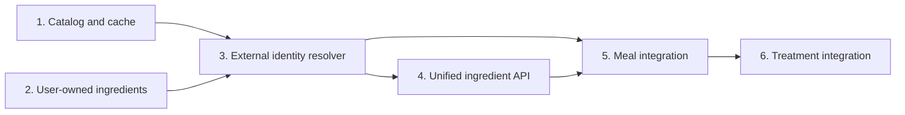
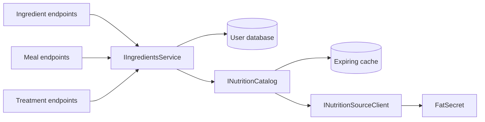

# Implementation slices for unified ingredients and nutrition sources

## Summary

Implement this as six sequential, reviewable slices. Each slice should compile, pass its focused tests, and leave the existing application usable. Subscription enforcement is deliberately deferred, but all provider access will pass through one service boundary so Pro gating can be added later without changing the ingredient, meal, or treatment contracts.



## How to use this document

Each numbered slice is intended to be completed in a separate session and merged before starting a dependent slice. A session should:

1. Read this slice and the [main integration design](nutrition-integration-plan.md).
2. Confirm that its prerequisite slices are present in the working branch.
3. Implement only the stated in-scope behavior.
4. Add or update the focused tests owned by that slice and run the affected project tests plus a solution build.
5. Stop when the slice's completion checks pass; do not pull work forward from later slices.

Shared decisions that apply to every slice:

- The public API knows `ingredientId` and `productId`, but never a provider name or provider selection.
- FatSecret `food_id` and `serving_id` may be stored permanently; provider names, barcodes, serving descriptions, measurements, images, and macros may be cached for no more than 24 hours.
- Custom ingredients permanently own their descriptive and nutritional data.
- Meal and treatment aggregate totals are permanent snapshots.
- Provider failures must not break local-only behavior.
- Pro entitlement enforcement is not part of the six slices; the code should centralize provider access without adding a speculative subscription abstraction.

## Target service architecture

The existing public nutrition endpoints are temporary. The end state replaces them with internal services consumed by the normal ingredient, meal, and treatment flows:

- `INutritionSourceClient` remains the low-level provider adapter implemented by the FatSecret client. API endpoints must not use it directly.
- A new internal `INutritionCatalog` in `CgmLink.Nutrition` owns provider selection, cache-aside reads, forced refreshes, expiry enforcement, and provider-neutral product models.
- `IIngredientsService` is the application-facing integration boundary. It combines user-owned ingredient data with `INutritionCatalog` results and resolves ingredient/product selections for meals and treatments.
- Ingredient endpoints call `IIngredientsService` for search and detail lookup instead of querying repositories or nutrition clients independently.
- Meal and treatment endpoints continue calling `IIngredientsService`, which transparently handles either `ingredientId` or `productId`.
- `AddNutrition` continues registering the catalog, cache, and provider adapter. `MapNutritionEndpoints` and `/nutrition/*` are removed after the ingredient endpoints expose equivalent behavior.



No API endpoint should inject `INutritionSourceClient` or `INutritionCache`. Provider-specific behavior stops at the catalog boundary, and nutrition-source data appears to clients only through ingredient-shaped contracts.

## Slice 1 — Nutrition catalog and compliant cache

### Context and starting point

This slice creates the provider-facing foundation without changing public endpoints. The repository already has `INutritionSourceClient`, the FatSecret implementation, `INutritionCache`, and an EF cache database. The current cache entity represents only one set of macro values, does not preserve all servings or barcode mappings, and is not integrated into provider reads.

Prerequisites: none. This slice may be implemented independently of Slice 2.

Primary project areas:

- `CgmLink.Nutrition.Source` and `CgmLink.Nutrition.FatSecretClient` for normalized provider models.
- `CgmLink.Nutrition.Caching` and `CgmLink.Nutrition.Caching.Ef` for cache contracts and storage.
- `CgmLink.Nutrition` for the internal catalog orchestration.

### In scope

- Add `INutritionCatalog` over `INutritionSourceClient` as the only consumer of the provider adapter and nutrition cache.
- Give the catalog provider-neutral search, product lookup, barcode lookup, and forced-refresh operations needed by later slices.
- Expand the cache to hold a complete product, all servings, and temporary barcode mappings.
- Implement cache-aside product and barcode retrieval.
- Support forced provider refresh for calculations.
- Never return expired content or cache provider content for more than 24 hours.
- Keep search as a provider call for now; do not add speculative search-query caching.

The catalog must expose distinct normal and forced-refresh paths. Normal product/barcode reads may use an unexpired cache entry. Forced refresh must call the provider and replace the cached product before returning.

Keep the current `/nutrition/*` handlers working during this slice, but change them to call `INutritionCatalog` rather than `INutritionSourceClient`. They are compatibility callers of the new service until Slice 4 removes them; do not add new nutrition endpoints.

### Out of scope

- Ingredient, meal, or treatment schema changes.
- Moving or removing public nutrition endpoints.
- User ownership and subscription checks.
- Search-result caching or alternative cache providers.

### Completion checks

- Product and barcode cache hit/miss/expiry behavior works.
- Multiple serving IDs round-trip through the cache.
- Forced refresh bypasses cached nutrition.
- No provider data enters the primary user database.

## Slice 2 — User-owned custom ingredients

### Context and starting point

Today `Ingredient` is globally shared, users are attached through `UserIngredient`, and barcode is globally unique. A user can therefore be linked to a row that another user can edit. This slice makes custom ingredients genuinely user-owned and removes barcode from the custom-ingredient domain.

Prerequisites: none. This slice may be implemented independently of Slice 1. It is a clean breaking migration; no dual-read or compatibility period is required.

Primary project areas:

- `CgmLink.Data` entities and relationships.
- `CgmLink.Data.Migrators.MSSQL` migration and model snapshot.
- `CgmLink.Api` custom ingredient endpoints, services, validators, responses, and tests.

### In scope

- Add direct ingredient ownership through `OwnerUserId`.
- Remove `Ingredient.Barcode`, its index, and barcode fields from custom ingredient APIs.
- Remove client-settable `ProductId` from custom ingredient creation.
- Update list/get/update/delete validation to use direct ownership.
- Migrate existing local ingredients:
  - Assign single-user ingredients directly.
  - Duplicate shared local ingredients and servings per linked user.
  - Remap meal and treatment references using their owning user.
- Remove `UserIngredient` after ownership data is migrated.

The migration must preserve existing usage. When a shared local ingredient has several linked users, create one ingredient and serving set per user, then remap `MealIngredient` and `TreatmentIngredient` using the owning meal or treatment user before removing the shared row and link table.

### Out of scope

- External product identity fields and provider-backed ingredient behavior.
- Nutrition cache work.
- Changes to meal or treatment request contracts.

### Completion checks

- Users cannot read or mutate another user's ingredient.
- Custom ingredient and serving behavior remains unchanged apart from barcode removal.
- Existing meal and treatment links remain valid after migration.

## Slice 3 — External identities and selection resolver

### Context and starting point

Slices 1 and 2 provide a compliant catalog and user-owned local ingredients. Meals and treatments still accept only local GUIDs. This slice adds the permanent provider ID records and a resolver that can turn either identifier form into the existing internal entities needed by the calculation services. It does not expose an import operation or change meal/treatment endpoints yet.

Prerequisites: Slices 1 and 2.

Primary project areas:

- `CgmLink.Data` and its migrator for external product/serving identity storage.
- `CgmLink.Api.Services.IngredientsService` as the application-facing integration service and selection resolver.
- `CgmLink.Nutrition` catalog from Slice 1.

### In scope

- Extend permanent ingredient storage for shared external products using server-only `Source` and provider `ProductId`.
- Represent external servings with server-only `Source`, `ProductId`, and provider `ServingId`; retain an internal surrogate key only where existing foreign keys require it.
- Store no provider names, barcodes, images, descriptions, measurements, or macros in the primary database.
- Implement `ResolveIngredientSelectionsAsync`:
  - Require exactly one of `ingredientId` and `productId`.
  - Parse the common string `servingId` as a local serving GUID or provider serving ID according to the selected identifier.
  - Validate custom ingredient ownership.
  - Force-refresh product selections when requested.
  - Validate the selected provider serving.
  - Automatically create or reuse the shared product and serving identity.
  - Return ephemeral resolved nutrition for calculation.
- Keep all catalog calls inside `IngredientsService`; meal and treatment endpoints must not acquire a second path to the nutrition catalog.
- Make resolution atomic from the caller's perspective: no meal/treatment changes if any external selection fails.

Resolve all provider data before mutating a meal or treatment. Upsert identity rows only after every requested product and serving has been validated. Concurrent first use of the same product must reuse the existing shared product identity.

Public request shape:

```json
{
  "ingredientId": "local-guid-or-null",
  "productId": "provider-id-or-null",
  "servingId": "local-guid-or-provider-serving-id",
  "quantity": 1.5
}
```

### Out of scope

- Public search, get, or barcode ingredient endpoints.
- Changes to current meal and treatment DTOs.
- Hydrating external details in API responses.
- Pro entitlement enforcement.

### Completion checks

- Local selections resolve only when owned by the current user.
- Product selections validate the provider product and selected serving.
- The first product use creates only permanently permitted IDs.
- Repeated or concurrent product use reuses the shared identity.
- A failed mixed selection produces no partial identity or caller mutation.

## Slice 4 — Unified ingredient API

### Context and starting point

The catalog, ownership model, and external identities now exist, but clients still use `/nutrition/*`. This slice moves discovery and detail hydration behind the ingredient API. It is the public cutover point: once complete, clients no longer need to know that FatSecret or a separate nutrition subsystem exists.

Prerequisites: Slices 1–3.

Primary project areas:

- `CgmLink.Api.Endpoints.Ingredients` for routes, requests, responses, and validation.
- `CgmLink.Api.Services.IngredientsService` for combined local/catalog search and lookup.
- `CgmLink.Nutrition` for the internal catalog called by `IngredientsService`.
- `CgmLink.Api.Program` and nutrition endpoint registration for removal of the old routes.

### In scope

- Add `GET /ingredients/search` returning grouped personal and provider results using one ingredient DTO.
- Change `GET /ingredients/{identifier}` to accept either an owned ingredient GUID or product ID.
- Add `GET /ingredients/barcode/{barcode}` using cache-aside provider lookup.
- Return the same response shape for both sources:
  - Exactly one of `ingredientId` and `productId`.
  - Servings with a string `servingId`.
  - Hydrated name, nutrition, `nutritionStatus`, and `dataAsOf`.
- Remove `/nutrition/*`, its endpoint mapping, and endpoint-specific DTOs.
- Retain the nutrition projects as internal catalog, cache, and provider infrastructure.
- Preserve required FatSecret attribution in provider-backed responses.

Do not move the existing nutrition handlers under a different route. Replace their behavior with ingredient endpoint handlers that call `IIngredientsService`, and delete the nutrition endpoint layer once the ingredient routes cover search, product lookup, and barcode lookup.

The `{identifier}` route must remove its current GUID-only constraint. Resolve an owned GUID locally first; otherwise treat the value as a product ID. Register the literal `/barcode/{barcode}` and `/search` routes so they cannot be captured by the identifier route.

If provider search fails, preserve any successful personal results and represent the provider group as unavailable rather than failing local search. Direct product and barcode lookups may return the mapped provider-unavailable response.

### Out of scope

- Meal and treatment request changes.
- Subscription enforcement.
- Merged cross-source ranking or pagination; keep the two result groups independently paged.

### Completion checks

- The client never chooses or names FatSecret.
- Custom and provider results use the same DTO.
- Barcode lookup never searches custom ingredients or writes to the primary database.
- Provider failure does not affect custom-only search and lookup.
- No `/nutrition/*` route is mapped, and no API endpoint directly injects the provider client or nutrition cache.

## Slice 5 — Meal integration

### Context and starting point

Clients can now discover either kind of ingredient through one API, and Slice 3 can resolve both identifier forms internally. Meals still accept `Guid IngredientId` and `Guid ServingId`, so they cannot yet consume product search results. This slice changes only meal contracts and behavior.

Prerequisites: Slices 1–4.

Primary project areas:

- `CgmLink.Api.Endpoints.Meals` create, update, and ingredient-list DTOs.
- `IIngredientsService`/selection resolver from Slice 3.
- `MealService` calculation and link update behavior.

### In scope

- Update create/update meal ingredient contracts to accept `ingredientId` or `productId`.
- Resolve every food selection before changing the tracked meal.
- On food composition changes:
  - Force-refresh provider products.
  - Materialize missing external identities.
  - Recalculate and persist aggregate totals.
  - Reject the whole write if a provider product or serving is unavailable.
- Metadata-only meal changes preserve totals and make no provider call.
- Hydrate provider-backed ingredient details on meal reads.
- During read outages, return stored meal totals and external references with unavailable detail status.

For updates, call the provider only when the request changes the ingredient collection, serving, or quantity. Name/image-only changes must not resolve or refresh nutrition. Validate and resolve the complete requested composition before modifying tracked meal links or totals.

The persisted meal aggregate remains the authoritative snapshot. Hydrated external line details describe current/cache data and may differ until the meal composition is next saved.

### Out of scope

- Treatment request or calculation changes.
- Recalculating historical treatments that reference the meal.
- Background refresh or reconciliation jobs.

### Completion checks

- Local-only meal writes work without provider availability.
- External first use creates identities without another client request.
- Failed external resolution leaves the existing meal unchanged.
- Current hydrated line values are distinguished from persisted aggregate totals.

## Slice 6 — Treatment integration

### Context and starting point

Meals now support both identifier forms. Treatments can reference saved meals and can also contain direct ingredients; only the direct ingredient path needs provider resolution. Treatment totals represent historical event snapshots and must not drift when meals or provider data later change.

Prerequisites: Slices 1–5.

Primary project areas:

- `CgmLink.Api.Endpoints.Treatments` create, update, get, and list contracts.
- `TreatmentService` food-link and aggregate calculation behavior.
- The shared ingredient resolver and response hydration introduced earlier.

### In scope

- Update treatment ingredient contracts to accept `ingredientId` or `productId`.
- Refresh direct provider ingredients only when treatment food composition changes.
- Use stored aggregate totals for referenced meals; do not recursively refresh or mutate their ingredients.
- Persist the recalculated treatment aggregate as an immutable snapshot.
- Injection-, reading-, and other metadata-only edits make no provider call.
- Hydrate direct external ingredient details on reads; retain stored totals when hydration is unavailable.
- Existing treatments do not change when a referenced meal is later edited.

When treatment food composition changes, validate all referenced meals and direct ingredient selections before mutating the treatment. Direct product selections use forced refresh. Referenced meals contribute their already stored aggregate totals and are never refreshed as a side effect.

When only injection, reading, timestamps, or other non-food metadata changes, retain the existing nutrition snapshot and make no catalog call.

### Out of scope

- Recalculating old treatments after meal updates.
- Recursively resolving the ingredients inside referenced meals.
- Subscription enforcement or background nutrition refresh.

### Completion checks

- Local-only treatments remain independent of provider availability.
- Direct product selections are refreshed and included in the new snapshot.
- Referenced meals contribute their stored totals without mutation.
- A failed provider resolution leaves the treatment and related injection/food changes uncommitted.
- Metadata-only edits preserve totals and make no provider call.
- Historical reads retain totals when external details cannot be hydrated.

## Deferred Pro-entitlement slice

### Context and prerequisite

The repository does not currently have subscription or entitlement persistence. Do not implement a placeholder entitlement model during Slices 1–6. This deferred slice can start only after the subscription system exposes a reliable current-user Pro entitlement.

Prerequisites: Slices 1–6 and the future subscription/entitlement feature.

### Integration work

- Keep every provider/cache call routed through the nutrition catalog or ingredient resolver.
- When subscriptions exist, add the entitlement check at that boundary before any provider or cache access.
- Non-Pro behavior will then be:
  - Custom ingredients remain fully available.
  - Provider search, product lookup, barcode lookup, and product-ID writes return `403`.
  - Existing meal/treatment aggregate snapshots remain readable without hydrating provider details.

The entitlement check must run before cache access as well as before outbound provider calls. This prevents non-Pro users from receiving provider content merely because it is cached. Local-only operations must not depend on the subscription service.

### Completion checks

- All provider-backed entry points enforce the same policy.
- Custom ingredient and local-only meal/treatment operations remain available without Pro.
- Downgraded users retain historical aggregate totals but receive no hydrated provider details.
- No endpoint performs its own divergent subscription logic.

## Assumptions

- These are clean breaking API and schema changes; no compatibility phase is required.
- Existing permanent `ProductId` values belong to FatSecret.
- Persisting calculated meal/treatment aggregate totals is permitted by the project's FatSecret agreement and still requires confirmation.
- Provider-returned barcode and nutrition content remain confined to the expiring cache.
- Each numbered slice is intended to be a separate PR or implementation task.

## Session handoff checklist

At the end of each slice, record in the PR or session summary:

- Which slice was completed and which prerequisite commit/branch it used.
- Public contracts, migrations, or configuration changed by the slice.
- Focused tests and build commands run.
- Any intentionally deferred item, tied to a later slice rather than left as an open design decision.
